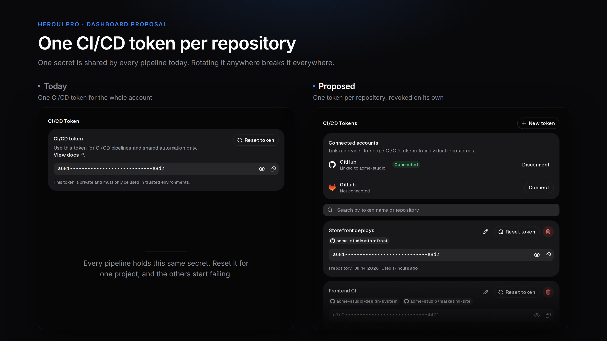

# Scoped CI/CD tokens — a proposal for the HeroUI Pro dashboard



A working redesign of `heroui.pro/dashboard/pro/tokens`, built entirely with
`@heroui/react` and `@heroui-pro/react`.

## The problem

The dashboard issues exactly two tokens per account: one personal token, and one
CI/CD token. The personal token is fine — it belongs to a person and is used on
one machine.

The single CI/CD token is not. A workspace with several repositories has to paste
that same secret into every pipeline, which means:

- **Rotation is all-or-nothing.** Resetting the token to fix one repository breaks
  the builds of every other repository at the same time.
- **A leak has no blast radius.** A secret exposed in one public repository's CI
  logs grants HeroUI Pro installs everywhere.
- **Nothing is traceable.** Usage cannot be attributed to a project, and there is
  no way to answer "which repository is still using this?" before rotating.

## The proposal

Keep the personal token exactly as it is. Turn the CI/CD section into a list of
tokens the user creates, each one bound to the repositories it is allowed to
authenticate for.

- **Connect a provider.** GitHub and GitLab are linked through OAuth, read-only,
  repository metadata only.
- **Scope a token.** One token can cover a single repository or several, picked
  from the connected accounts.
- **Edit a scope** after the fact, without reissuing the secret.
- **Reset** a token to rotate its secret, or **revoke** it to delete it for good.

Both destructive actions take two deliberate steps: reset asks for an explicit
acknowledgement, revoke asks the user to type the token name. Each dialog names
what stops working, and which repositories lose access.

## At scale

Per-repository tokens multiply: a workspace that adopts them ends up with
dozens. The demo ships forty, and the screen is built for that number.

- The list **searches by token name and by repository**, so "which token still
  reaches `acme-studio/storefront`?" takes one query instead of a scroll.
- It **pages at five cards**, with a summary reading `1-5 of 40 tokens`.
- A token scoped to many repositories shows **four chips and a counter**; the
  counter opens the full list, grouped by provider, in a modal. Cards keep a
  fixed height whether a token covers one repository or nineteen.
- The picker **selects every search match at once**, because scoping a token to
  a whole platform should not mean nineteen clicks.

## Running it

```bash
pnpm install
pnpm dev
```

`/` is the proposal. `/before` rebuilds today's screen with the same components,
so both can be compared under identical conditions.

`@heroui-pro/react` requires a HeroUI Pro license: run `npx heroui-pro login`
before installing, or set `HEROUI_AUTH_TOKEN` in CI.

The page is locked to the dark theme so it can be compared with the current
dashboard screen. Every color comes from HeroUI theme variables, so removing the
`dark` class from `<html>` in `src/app/layout.tsx` renders the same screen in
light mode.

## What is real and what is mocked

Everything is client state, in `src/data/demo-data.ts`. There is no backend:
provider authorization is simulated with a delay, and secrets are generated in
the browser. In a real implementation, secrets are minted server side and shown
once.

## Structure

| Path | What it holds |
| --- | --- |
| `src/app/page.tsx` | Dashboard shell: sidebar plus the tokens screen |
| `src/components/tokens/tokens-view.tsx` | Page state and layout |
| `src/components/tokens/scoped-token-list.tsx` | Search, paging, empty states |
| `src/components/tokens/personal-token-card.tsx` | Personal token, unchanged |
| `src/components/tokens/scoped-token-card.tsx` | One CI/CD token and its scope |
| `src/components/tokens/repository-scope-list.tsx` | Scope chips, and the full list modal |
| `src/components/tokens/token-scope-dialog.tsx` | Create a token, or edit its scope |
| `src/components/tokens/reset-token-dialog.tsx` | Two-step secret rotation |
| `src/components/tokens/revoke-token-dialog.tsx` | Two-step deletion |
| `src/components/tokens/connected-accounts-card.tsx` | GitHub and GitLab links |
| `src/components/tokens/repository-picker.tsx` | Searchable repository list |
| `src/components/tokens/secret-field.tsx` | Masked secret with reveal and copy |

## Components used

`@heroui/react`: AlertDialog, Avatar, Button, Card, Checkbox, CheckboxGroup,
Chip, Description, Input, InputGroup, Label, Link, Modal, Pagination, Separator,
TextField, Toast.

`@heroui-pro/react`: Sidebar, EmptyState.

No other UI dependency. Icons come from `@gravity-ui/icons`, except the GitHub
and GitLab marks, which are inlined in `src/components/icons/provider-icons.tsx`.
